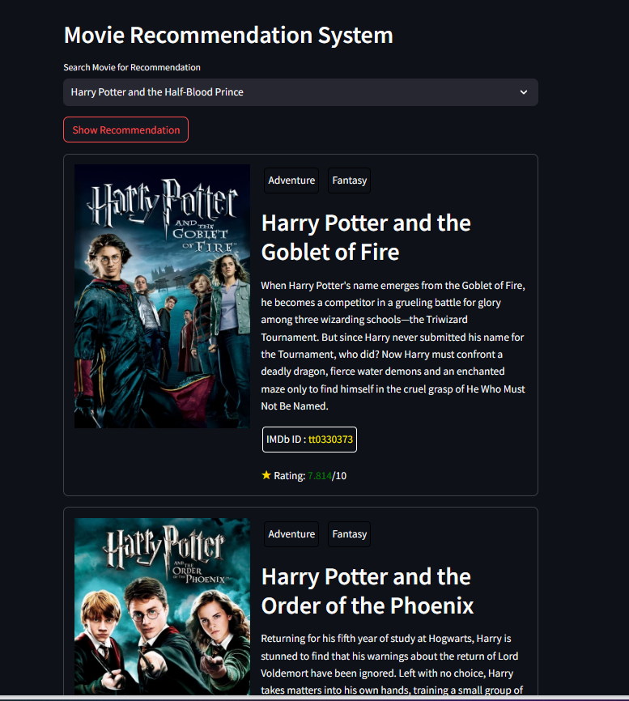

# Movie Recommendation System

## Overview

This repository contains the source code for a movie recommendation system built using collaborative filtering. The system utilizes a dataset of movie information, including user preferences, to generate personalized movie recommendations.

## Features

- **Recommendation Algorithm:** The system employs collaborative filtering to suggest movies based on user preferences and similarities between movies.
- **Data Source:** Movie data is sourced from The Movie Database (TMDb) API, providing comprehensive details such as title, poster images, and user ratings.
- **Streamlit App:** The user interface is built using Streamlit, allowing users to interactively search for movies and receive personalized recommendations.

## Key Components

- **fetch_poster function:** Retrieves movie poster images from the TMDb API.
- **recommend function:** Implements collaborative filtering to generate movie recommendations.
- **Streamlit App:** Provides an intuitive interface for users to input their movie preferences and view recommendations.

## Usage

1. **Clone the repository:**

    ```bash
    git clone https://github.com/your-username/movie-recommendation-system.git
    cd movie-recommendation-system
    ```

2. **Create virtual environment:**

    ```bash
    python -m venv env
    ```

3. **Activate virtual environment:**

    ```bash
    env\Scripts\activate
    ```

4. **Install dependencies:**

    ```bash
    pip install -r requirements.txt
    ```

5. **Run the Streamlit app:**

    ```bash
    streamlit run app.py
    ```

6. **Open your browser and navigate to `http://localhost:8501` to interact with the Movie Recommendation System.**

## Dataset

The dataset used for this project can be found [here](https://www.kaggle.com/datasets/tmdb/tmdb-movie-metadata/data). Make sure to download and use the dataset for a comprehensive movie database.

## Running App Screenshot



## Dependencies

- Python 3.x
- Streamlit
- Requests

## Contributing

Feel free to contribute by opening issues, suggesting improvements, or creating pull requests. We welcome collaboration from the community to enhance the functionality and user experience of the movie recommendation system.
